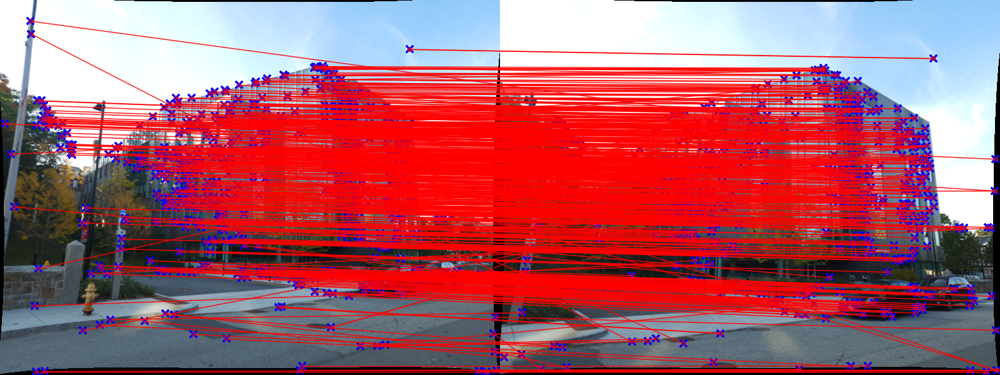
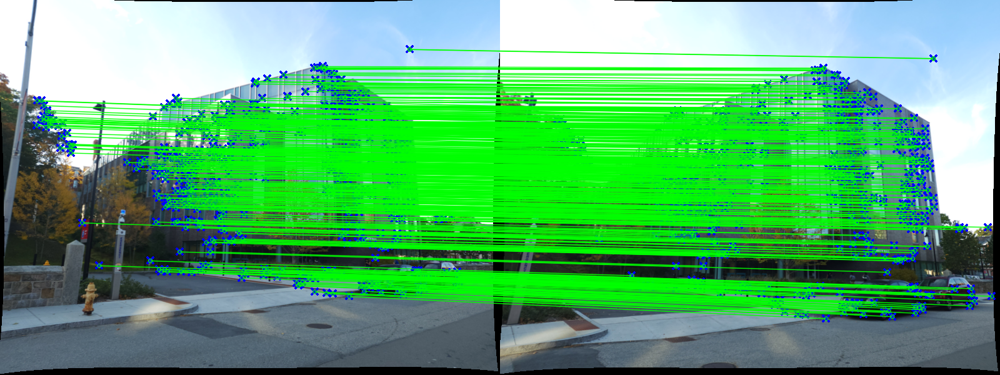
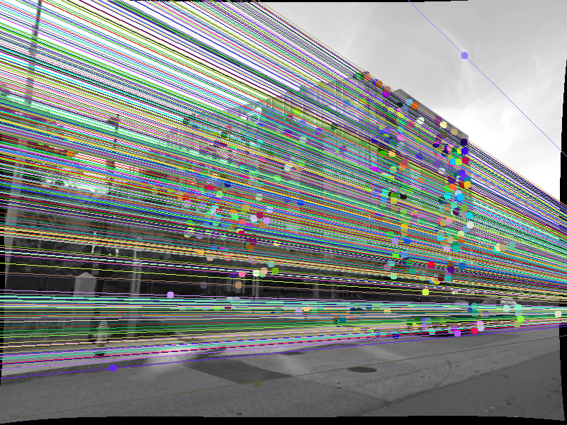
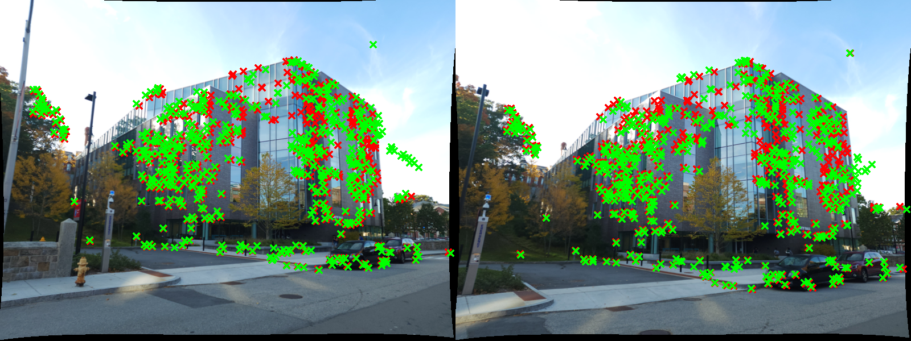
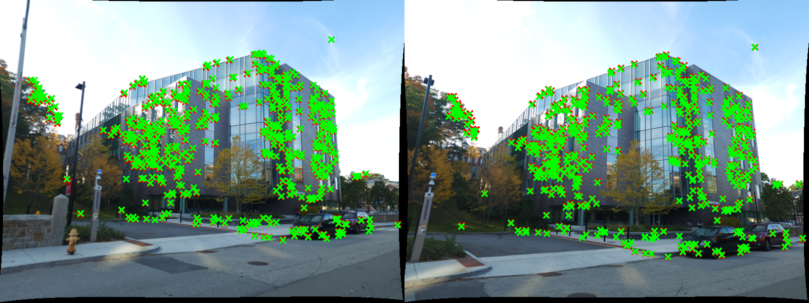
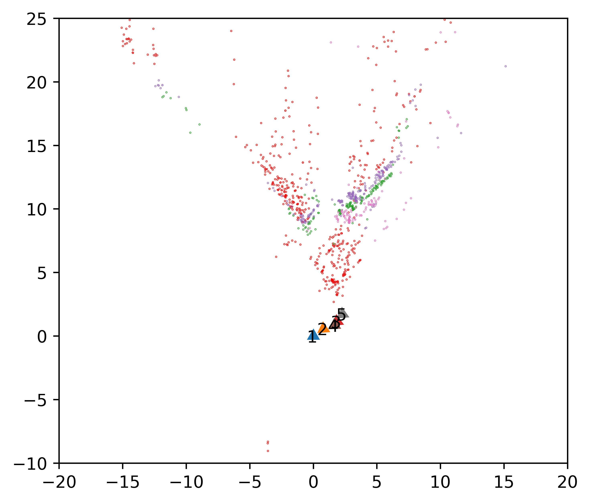
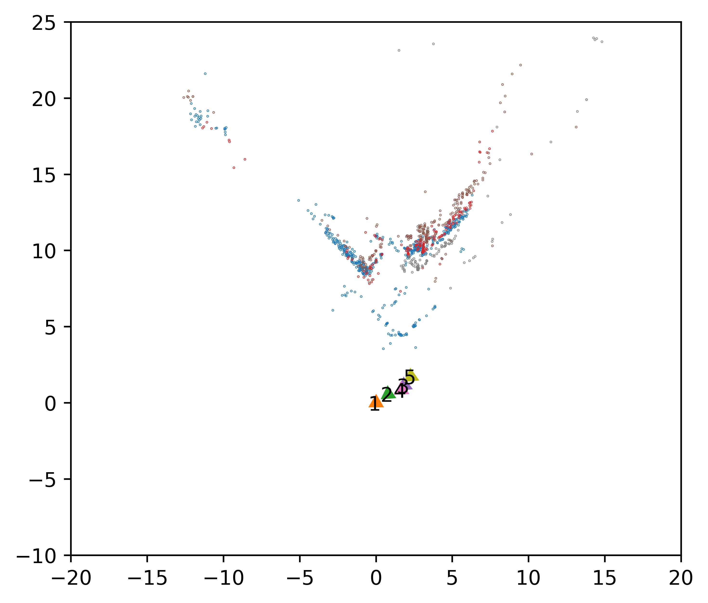
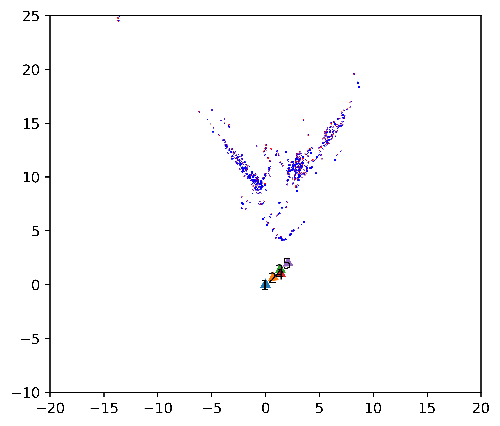
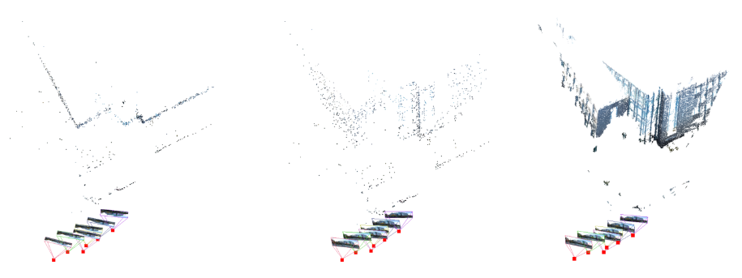

# Classical_Structure_from_Motion

### *RBE549: Computer Vision - [Worcester Polytechnic Institute](https://www.wpi.edu/), Spring 2024*

## Project Guidelines:
Details of the project can be found [here](https://rbe549.github.io/spring2024/proj/p2/).

### Overview:
This project, focuses on implementing a Structure from Motion (SfM) pipeline to reconstruct the 3D structure of Unity Hall at WPI using classical algorithms. The pipeline implements the following steps:
1. Feature Matching
2. Estimating Fundamental and Essential Matrices
3. Camera Pose Estimation
4. Triangulation and Non-linear Optimization
5. Perposepective-n-Point (PnP) 
6. Bundle Adjustment

### Data:
The data can be found [here](https://drive.google.com/file/d/1Li3UzocAe8l8PFbXbRSouzRJ2v3jczSw/view?usp=sharing)

Data directory must follow the following structure:
```
Data/
├── 1.png
├── 2.png
├── 3.png
├── 4.png
├── 5.png
├── calibration.txt
├── matching1.txt
├── matching2.txt
├── matching3.txt
└── matching4.txt
```

#### Steps to run the code:

To run Wrapper.py, use the following command:
```bash
python Wrapper.py --data_path <path_to_data_directory> --log_dir <path_to_log_directory> --no-log
usage: Wrapper.py [-h] [--data_path DATA_PATH] [--log_dir LOG_DIR] [--no-log]

optional arguments:
  -h, --help            show this help message and exit
  --data_path DATA_PATH
                        Path of input images and feature matches text files
  --log_dir LOG_DIR     Directory to save results
  --no-log              Do not log results
``` 

Example:
```bash
python Wrapper.py --data_path Data/ --log_dir Results/
```

### Results:
Feature Matching:
<p align="left">
  
</p>

Features after RANSAC:
<p align="left">
      
</p>

Epipolar Lines:
<p align="left">
    
</p>

Note: Following images are observed in the X-Z plane.
Linear Triangulation reprojection error:
<p align="left">
  
</p>

Non-linear Triangulation reprojection error:
<p align="left">
  
</p>

Linear PnP with Camera Poses:
<p align="left">
  
</p>

Non-linear PnP with Camera Poses:
<p align="left">
  
</p>

Bundle Adjustment with Camera Poses:
<p align="left">
  
</p>

Final 3D Reconstruction:
<p align="left">
  
</p>